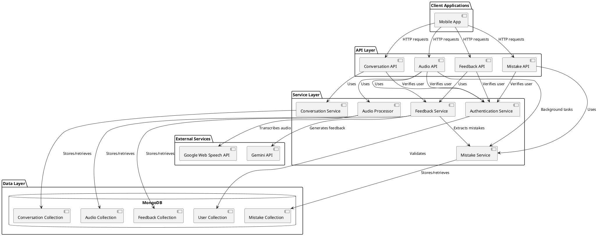

# Backend Component Diagram

The following component diagram illustrates the architecture of the backend system focusing on the speech feedback and mistake practice features.

This diagram shows the component architecture of the backend system with a focus on speech feedback and mistake practice functionality. The architecture follows a layered approach:

1. **Client Applications Layer** - Mobile app that interacts with the backend
2. **API Layer** - FastAPI endpoints that handle HTTP requests
3. **Service Layer** - Business logic for processing audio, generating feedback, and managing mistakes
4. **External Services Layer** - Third-party APIs for speech recognition and AI-based feedback
5. **Data Layer** - MongoDB collections for persistent storage

Key components:
- **Audio Processor** - Handles audio transcription using Google Web Speech API
- **Feedback Service** - Generates grammar and vocabulary feedback using Gemini API
- **Mistake Service** - Manages the extraction, storage, and practice of language mistakes
- **Authentication Service** - Validates user requests across all APIs 