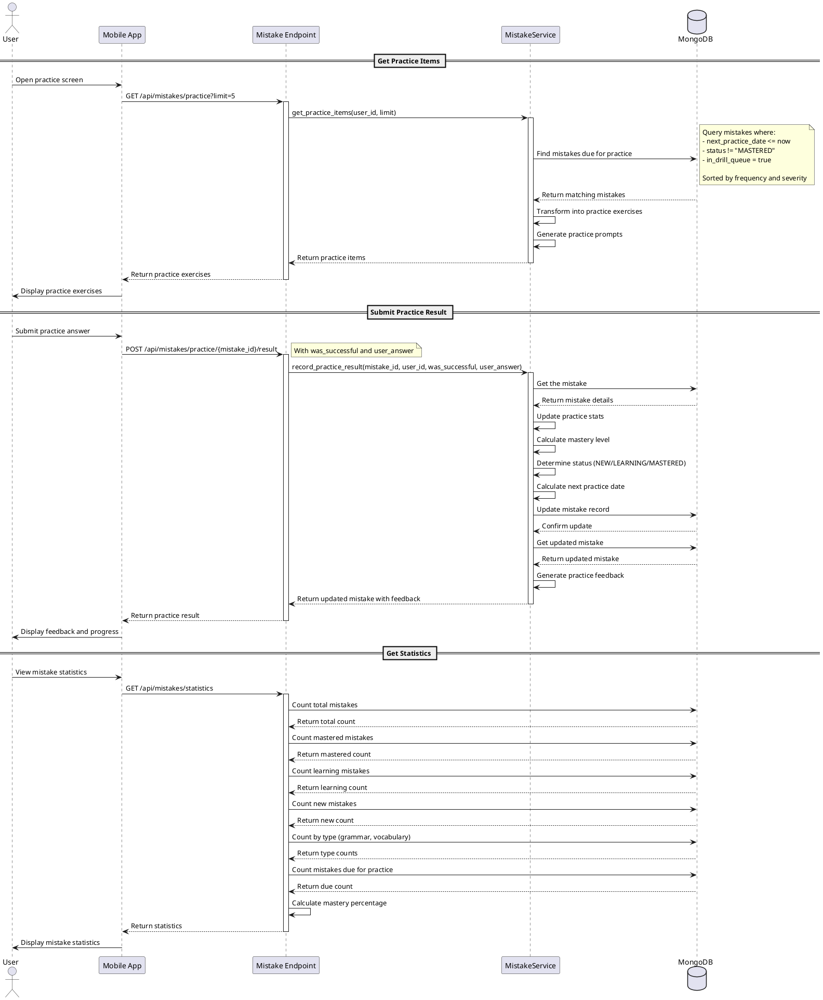

# Mistake Practice Sequence Diagram

The following sequence diagram illustrates the process flow for mistake practice in the backend.

This diagram shows the three main processes related to mistake practice:

1. **Getting Practice Items** - Retrieves mistakes due for practice based on spaced repetition scheduling
2. **Submitting Practice Results** - Records practice results and updates mistake status and scheduling
3. **Getting Statistics** - Provides an overview of the user's progress with mistakes

Key components in these processes:
1. **Mistake Endpoint** - Handles the API requests for practice and statistics
2. **MistakeService** - Implements the business logic for mistake practice
3. **MongoDB** - Stores and retrieves mistake records 