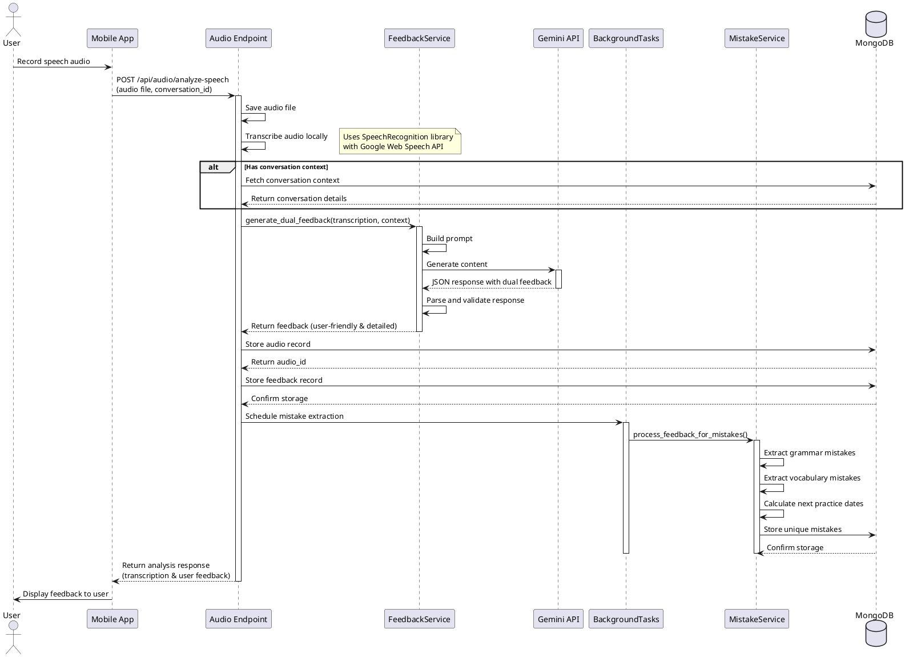

# Speech Analysis Sequence Diagram

The following sequence diagram illustrates the process flow for speech analysis in the backend.

This diagram shows the flow from the user recording speech through processing and feedback generation, ending with displaying results to the user while mistakes are extracted and stored in the background.

Key components in this process:
1. **Audio Endpoint** - Handles the API request, audio saving, and transcription
2. **FeedbackService** - Generates dual feedback using Gemini API
3. **BackgroundTasks** - Processes mistake extraction asynchronously
4. **MistakeService** - Extracts and stores mistakes for future practice
5. **MongoDB** - Stores audio, feedback, and mistake records 